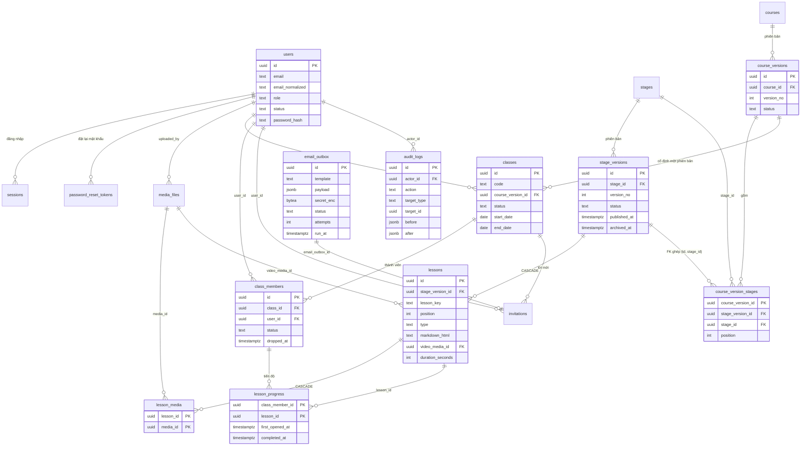

# Database

Schema PostgreSQL 16 của GoUp LMS, các quyết định thiết kế, hợp đồng mà mã Go phải giữ, và quy trình thay đổi schema hoặc dữ liệu. Nguồn chân lý là các file SQL trong [`apps/api/migrations/`](../apps/api/migrations/); tài liệu này giải thích chúng, không chép lại DDL.

## Sơ đồ quan hệ



`login_attempts` đứng riêng (không FK, `bigserial`): log append-only theo `email_normalized` cho khóa đăng nhập; worker xóa hàng cũ hơn 30 ngày.

| Migration | Nội dung |
|---|---|
| `0000_init` | No-op để thư mục embed không rỗng |
| `0001_schema_conventions` | `COMMENT ON SCHEMA public` ghi quy ước (xem bằng `\dn+`) |
| `0002_users_sessions` | `users`, `sessions` |
| `0003_media_files` | `media_files` |
| `0004_stages_versions_lessons` | `stages`, `stage_versions`, `lessons`, `lesson_media` |
| `0005_courses_versions` | `courses`, `course_versions`, `course_version_stages` |
| `0006_classes_members_invitations` | `classes`, `class_members`, `invitations` |
| `0007_lesson_progress` | `lesson_progress` |
| `0008_email_outbox_password_resets_login_attempts` | `email_outbox` (+ FK từ `invitations`), `password_reset_tokens`, `login_attempts` |
| `0009_audit_logs` | `audit_logs` (`action` không CHECK; danh sách chuẩn giữ ở mã Go) |

## Quyết định thiết kế

| Quyết định | Lý do và hệ quả |
|---|---|
| Enum là `text` + `CHECK` có tên | Thêm giá trị chỉ cần `DROP/ADD CONSTRAINT` trong một migration, không `ALTER TYPE` (vướng transaction của golang-migrate). Giá trị chuẩn: `classes.status` `draft\|active\|ended`; `class_members.status` `active\|dropped\|completed`; `email_outbox.template` `invite\|added\|resend\|password_reset` |
| PK `uuid` không `DEFAULT`, giá trị uuid v7 sinh ở Go (`platform/ids`) | Không cần extension; id có thứ tự thời gian nên index B-tree không phân mảnh |
| Vị trí sắp xếp UNIQUE `DEFERRABLE INITIALLY IMMEDIATE` (`uq_lessons_version_position`, `uq_cvs_version_position`) | Reorder nhiều hàng trong một tx: `SET CONSTRAINTS <tên> DEFERRED` rồi UPDATE tùy thứ tự; không DEFERRED thì UPDATE từng hàng lần lượt báo `23505` |
| `ON DELETE RESTRICT` mặc định; chỉ hai CASCADE | `fk_lessons_stage_version` và `fk_lesson_media_lesson`: xóa bản nháp chặng xóa luôn bài học nháp và liên kết media. Mọi FK khác chặn xóa dữ liệu đang được tham chiếu (`23503`) |
| FK ghép `fk_cvs_stage_version (stage_version_id, stage_id) → stage_versions (id, stage_id)` | `course_version_stages.stage_id` do ứng dụng điền; lệch chặng báo `23503` mà không cần trigger. Dựa trên `uq_stage_versions_id_stage` |
| Một bản nháp mỗi chặng/khóa học | Partial unique index `uq_stage_versions_one_draft`, `uq_course_versions_one_draft` (`WHERE status = 'draft'`) |
| Cặp cột trạng thái khóa ở mức hàng | `ck_*_published_at`, `ck_*_archived_at`: `published_at` có khi và chỉ khi đã phát hành, `archived_at` có khi và chỉ khi `archived` |
| Email lưu hai cột | `email` để hiển thị, `email_normalized` UNIQUE; chuẩn hóa ở Go, DB chỉ `CHECK (email_normalized = lower(btrim(email_normalized)))` |
| `updated_at` do ứng dụng set | Không trigger; mọi UPDATE phải tự ghi `updated_at` |
| Mỗi file migration là một transaction | Không dùng `CREATE INDEX CONCURRENTLY` |
| **D1: không function, trigger, type hay extension do người dùng tạo** | Toàn bộ logic nghiệp vụ nằm ở Go để test unit, debug và review tại một chỗ; schema chỉ mô tả dữ liệu. Hàm built-in (`now()`, `lower()`, `btrim()`, `pg_advisory_xact_lock()`) gọi trong SQL của ứng dụng vẫn được dùng. Giới hạn chấp nhận: không có lớp chặn ở DB, nên SQL thủ công qua `psql` có thể sửa bản `published`; bù lại bằng quy tắc vận hành bên dưới và tài khoản DB của ứng dụng là tài khoản ghi duy nhất trên production |

D1 được canh bằng test `TestNoUserDefinedDatabaseObjects` trong [`migrations_test.go`](../apps/api/migrations/migrations_test.go) (đếm `pg_trigger` không nội bộ, `pg_proc`/`pg_type` trong `public`, `pg_extension` khác `plpgsql`, tất cả phải bằng 0) và bằng grep cấm ở mục [Thêm migration](#thêm-migration).

## Bất biến phiên bản ở tầng ứng dụng

Phiên bản chặng (`stage_versions`) và khóa học (`course_versions`) đi theo vòng đời `draft → published → archived`. Vì D1, mọi bất biến liên hàng là hợp đồng của mã Go, không phải của DB.

| Bất biến | Cơ chế cũ (đã bỏ) | Cơ chế ở ứng dụng |
|---|---|---|
| Header `published`/`archived` không sửa, không xóa; chỉ `published → archived` | Trigger `forbid_non_draft_change()` | Domain từ chối mutation khi `status != draft` (`ErrVersionImmutable`), `Archive()` chỉ từ `published`, `CanDelete()` chỉ `draft`. Repository: `SaveDraft` `UPDATE ... WHERE id = $1 AND status = 'draft'`; `TransitionStatus` `WHERE id = $1 AND status = $from`; `Delete` `WHERE id = $1 AND status = 'draft'`; mọi câu qua `db.ExecAffectOne`, 0 dòng → `ErrVersionImmutable` (SaveDraft/Delete) hoặc `ErrInvalidTransition`. DB khóa cặp cột bằng `ck_*_published_at`, `ck_*_archived_at` |
| Bảng con (`lessons`, `lesson_media`, `course_version_stages`) chỉ ghi khi cha `draft` | Trigger `lessons_guard()`, `course_version_stages_guard()` | SQL có điều kiện trên cha (mẫu bên dưới); `lesson_media` ghi theo `lesson_id` ngay sau khi bài học đã qua điều kiện trong cùng tx; 0 dòng → `ErrVersionImmutable`. Xóa bản nháp dùng `ON DELETE CASCADE` |
| Không phát hành chặng khi còn bài markdown `markdown_html IS NULL` | Trigger `stage_versions_publish_guard` | Domain `Publish(now)` trả `ErrNotRendered` (409 `INVALID_TRANSITION`, "Phiên bản còn học liệu chưa render."); repository dùng `NOT EXISTS` (mẫu bên dưới); 0 dòng → `ErrInvalidTransition` |
| `course_version_stages.stage_id` khớp `stage_versions.stage_id` | Trigger `cvs_sync_stage_id()` | Ứng dụng điền `stage_id` từ tham chiếu phiên bản chặng; FK ghép `fk_cvs_stage_version` báo `23503` khi lệch |
| Hai transaction song song (thêm bài học và phát hành) không cùng commit | Trigger cũng không bảo đảm | Mọi use case ghi: mở transaction → `SELECT ... FOR UPDATE` header (`ByIDForUpdate`) trước mọi đọc/ghi con. Bên đến sau đọc trạng thái mới và nhận `ErrVersionImmutable` hoặc 0 dòng |

Mẫu SQL hợp đồng (đã chạy trên schema thật trong `TestConditionalSQLContract`):

```sql
-- Sửa header bản nháp
UPDATE stage_versions SET title = $2, updated_at = $3 WHERE id = $1 AND status = 'draft';

-- Thêm bài học: 0 dòng nếu cha không còn draft
INSERT INTO lessons (id, stage_version_id, lesson_key, position, title, type, markdown_source)
SELECT $2, $1, $3, $4, $5, 'markdown', $6 FROM stage_versions WHERE id = $1 AND status = 'draft';

-- Sửa và xóa bài học
UPDATE lessons l SET title = $2, updated_at = $3
  FROM stage_versions sv WHERE l.id = $1 AND sv.id = l.stage_version_id AND sv.status = 'draft';
DELETE FROM lessons l USING stage_versions sv
  WHERE l.id = $1 AND sv.id = l.stage_version_id AND sv.status = 'draft';

-- Phát hành chặng
UPDATE stage_versions SET status = 'published', published_at = $2, updated_at = $2
  WHERE id = $1 AND status = 'draft'
    AND NOT EXISTS (SELECT 1 FROM lessons WHERE stage_version_id = $1 AND type = 'markdown' AND markdown_html IS NULL);
```

Helper dùng chung ở [`platform/db/exec.go`](../apps/api/internal/platform/db/exec.go):

```go
var ErrNoRowsAffected = errors.New("db: no rows affected")
// ExecAffectOne chạy câu lệnh và trả ErrNoRowsAffected khi RowsAffected() != 1.
// Mọi UPDATE/DELETE/INSERT...SELECT có điều kiện trạng thái bắt buộc đi qua hàm này.
func ExecAffectOne(ctx context.Context, ex Executor, query string, args ...any) error
```

Quy ước review cho `features/stages` và `features/courses`:

- Không có UPDATE/DELETE lên `stage_versions`, `course_versions`, `lessons`, `lesson_media`, `course_version_stages` thiếu điều kiện trạng thái.
- Không có INSERT vào ba bảng con mà không phải dạng `INSERT ... SELECT ... WHERE status = 'draft'`.
- Mọi use case ghi lên một phiên bản khóa header bằng `SELECT ... FOR UPDATE` trước.
- Integration test của repository gọi thẳng lên bản `published` (bỏ qua service) để chứng minh lớp SQL tự đứng được khi lớp domain bị bỏ qua, và có test đua thêm bài học với phát hành.

## Hợp đồng `email_outbox`

| Cột | Ý nghĩa |
|---|---|
| `to_email`, `template` | Người nhận; mẫu thư `invite\|added\|resend\|password_reset` (cùng tên với `invitations.kind`) |
| `payload jsonb` | Dữ liệu dựng thư. **Không bao giờ chứa mật khẩu tạm hay token** |
| `secret_enc bytea` | Bí mật duy nhất của thư (mật khẩu tạm hoặc token đặt lại) mã hóa AES-256-GCM bằng `OUTBOX_SECRET_KEY`; về `NULL` khi `sent` hoặc `failed` cuối |
| `status` | `queued → sending → sent`, hoặc quay lại `queued` khi lỗi tạm, `failed` khi hết lượt |
| `attempts`, `run_at`, `locked_until`, `last_error`, `sent_at` | Đếm lượt lỗi, thời điểm đến hạn, hạn khóa claim, lỗi cuối, thời điểm gửi |

Không có `updated_at`: mỗi chuyển trạng thái ghi cột thời điểm riêng. Worker claim bằng câu duy nhất (index `ix_email_outbox_claim ON (run_at) WHERE status IN ('queued','sending')`):

```sql
UPDATE email_outbox SET status = 'sending', locked_until = now() + interval '2 minutes'
WHERE id IN (
  SELECT id FROM email_outbox
  WHERE (status = 'queued' AND run_at <= now()) OR (status = 'sending' AND locked_until < now())
  ORDER BY run_at LIMIT $1 FOR UPDATE SKIP LOCKED)
RETURNING *;
```

- `attempts` chỉ tăng trong `MarkFailedAttempt`: đạt 3 → `failed`, `secret_enc = NULL`; chưa đạt → `queued` với backoff 1m/5m/15m.
- `MarkSent` đặt `sent`, `sent_at`, `secret_enc = NULL`.
- Hàng `sending` bị kẹt (worker chết) được claim lại khi `locked_until` qua.
- Không log, không trả `secret_enc` qua API.

## Sổ tên constraint

Mọi constraint có tên theo quy ước `pk_<table>`, `uq_<table>_<cols>`, `fk_<table>_<col>`, `ck_<table>_<rule>`; partial unique index cũng mang tiền tố `uq_`. Mỗi tên là một hằng Go trong [`pgerr/constraints.go`](../apps/api/internal/platform/db/pgerr/constraints.go) (ví dụ `UqUsersEmailNormalized`, `UqStageVersionsOneDraft`, `FkCvsStageVersion`); mã nghiệp vụ map lỗi theo `PgError.ConstraintName` và chỉ dùng hằng, không viết chuỗi. File chỉ chứa hằng (không import) để gói `pgerr` thêm phần map lỗi mà không vòng phụ thuộc.

`constraints_test.go` so tập hằng với `pg_constraint` ∪ index unique `uq_%` trong `pg_class` theo cả hai chiều, và kiểm tên hằng là CamelCase của giá trị. Thêm hoặc đổi tên constraint mà quên cập nhật hằng sẽ làm test đỏ.

## Thêm migration

1. Kiểm version hiện tại: `go run ./cmd/lms migrate version` (hoặc `make migrate-version`).
2. Tạo cặp `NNNN_<slug>.up.sql` / `.down.sql` với số kế tiếp, slug snake_case tiếng Anh mô tả nội dung. Dòng đầu file `.up.sql` là comment một dòng mô tả. Không đặt mã plan hay phase trong tên file.
3. Viết `down` xóa đúng những gì `up` tạo theo thứ tự ngược, dùng `DROP ... IF EXISTS`.
4. Đặt tên mọi constraint theo quy ước và thêm hằng vào `pgerr/constraints.go`.
5. Theo expand/contract để image N-1 vẫn chạy trên schema N: thêm cột nullable hoặc có default trước, triển khai mã đọc/ghi cột mới, rồi mới siết `NOT NULL` hoặc xóa cột cũ ở migration sau. Không đổi tên hay xóa cột trong cùng bản phát hành với mã ngừng dùng nó.
6. Cập nhật hằng `schemaVersion` trong `migrations_test.go`, thêm test cho constraint mới, chạy integration test.
7. Grep cấm phải rỗng:

   ```bash
   cd apps/api
   ! grep -rniE 'CREATE (OR REPLACE )?(FUNCTION|PROCEDURE|TRIGGER|TYPE|EXTENSION)' migrations/
   ```

## Xử lý `dirty`

golang-migrate chạy mỗi file trong một transaction; nếu migration lỗi, version bị đánh dấu `dirty` và mọi lệnh migrate sau đó dừng. CLI không có lệnh `force`. Quy trình:

1. Đọc log lỗi, kiểm schema bằng `psql` để biết migration lỗi đã áp tới đâu (thường là chưa áp gì vì transaction đã rollback).
2. Sửa tay bảng version về trạng thái thật: `UPDATE schema_migrations SET dirty = false, version = <v>;` với `<v>` là version cuối đã áp trọn vẹn.
3. Sửa file migration, chạy lại `lms migrate up`.

## Rollback

- Dev: `docker compose down -v` xóa volume rồi `make migrate-up && make seed`.
- Production: hạ tag image với `MIGRATE_ON_START=false`; nhờ expand/contract, image N-1 chạy được trên schema N nên thường không cần hạ schema.
- Chỉ chạy `lms migrate down --steps 1` khi thật cần, sau khi `pg_dump -Fc` và chỉ cho migration cuối cùng. Không `down` nhiều bước trên production.

## Quy tắc vận hành

- **Không sửa dữ liệu nghiệp vụ bằng SQL tay trên production.** Mọi sửa chữa đi qua ứng dụng hoặc một migration có review, sau khi `pg_dump -Fc`. Không cấp quyền ghi ad-hoc cho người.
- `audit_logs.before/after` không bao giờ chứa `password_hash` hay bí mật khác; bộ ghi audit của ứng dụng phải lọc các khóa nhạy cảm.
- `sessions.token_hash` và `password_reset_tokens.token_hash` chỉ lưu hash; token gốc không chạm DB.
- `login_attempts` chứa email và IP (dữ liệu cá nhân); giữ tối đa 30 ngày.

## Dữ liệu mẫu (`lms seed`)

`lms seed` (gói [`internal/seed`](../apps/api/internal/seed/)) nạp dữ liệu chép nguyên văn từ `prototype/seed.js`: 17 user, 5 chặng (16 bài, 9 video), khóa `BASIC` v1, 3 lớp `basic01`/`basic02` (`active`) và `basic03` (`draft`), 15 thành viên, lời mời kèm `email_outbox` (`sent`/`failed`/`queued`), tiến độ và 10 bản ghi audit. Mốc thời gian tính tương đối từ đồng hồ lúc chạy.

- Từ chối khi `APP_ENV=production` ("seed bị tắt ở production") và khi thiếu `SEED_PASSWORD` hoặc ngắn hơn 12 ký tự; mọi user dùng `argon2id(SEED_PASSWORD)`.
- Chạy trong một transaction có advisory lock; nếu đã có `quan.tran@goup.vn` thì in "đã seed" và thoát 0.
- `--reset` (chỉ `APP_ENV` là `dev` hoặc `e2e`) TRUNCATE mọi bảng nghiệp vụ rồi seed lại; `make seed-reset` gọi lệnh này.
- `--upload-sample` chưa được hỗ trợ (exit 1); bản ghi video có `storage_key = 'seed/<file>.mp4'` nhưng file không có trong MinIO, nên video seed trả 404 ở dev.
- Seed ghi SQL trực tiếp, chèn header ở trạng thái cuối `published`; mọi bài markdown có `markdown_html` viết sẵn trong `markdown.go`, chỉ dùng thẻ trong allowlist bài học. Hàng outbox có `secret_enc = NULL` và `payload` không mật khẩu.
- Chỉ in số bản ghi mỗi bảng, không in email hay mật khẩu.

## Chạy integration test

Integration test dùng build tag `integration` và database riêng `lms_test` (tạo bởi `infra/postgres/init/`):

```bash
cd apps/api
make test-integration          # đọc TEST_DATABASE_URL từ .env
# hoặc
TEST_DATABASE_URL=postgres://lms:<mật khẩu>@localhost:<cổng>/lms_test?sslmode=disable \
  go test -race -count=1 -tags integration ./...
```

- [`internal/platform/testdb`](../apps/api/internal/platform/testdb/testdb.go): `Open(t)` migrate `lms_test` lên version mới nhất và giữ một advisory lock cấp session suốt tiến trình test, nên các package chạy song song bởi `go test ./...` được tuần tự hóa trên cùng database; `Reset(t, db)` TRUNCATE mọi bảng trừ `schema_migrations`.
- Không trỏ `TEST_DATABASE_URL` vào database có dữ liệu thật: test xóa sạch dữ liệu và chạy migrate down/up.
- CI job `api` chạy `go vet` (cả hai tag), golangci-lint và integration test trên Postgres 16.
